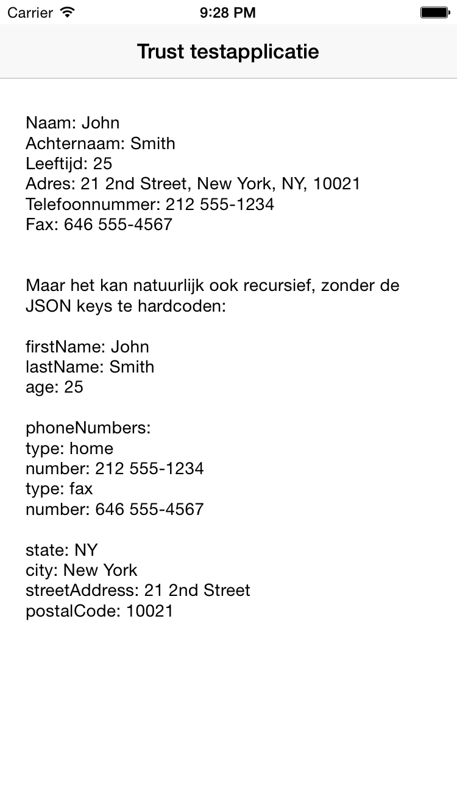

# Trust testapplicatie

Application that reads the JSON file below (from a remote URL) and parses it on the screen:
```
{
     "firstName": "John",
     "lastName": "Smith",
     "age": 25,
     "address":
     {
         "streetAddress": "21 2nd Street",
         "city": "New York",
         "state": "NY",
         "postalCode": "10021"
     },
     "phoneNumber":
     [
         {
           "type": "home",
           "number": "212 555-1234"
         },
         {
           "type": "fax",
           "number": "646 555-4567"
         }
     ]
 }
```
**Note:** I've only tested this application on a iPhone 6 iOS Simulator.

## Techniques

### Libraries
I've used the [AFNetworking library](https://github.com/AFNetworking/AFNetworking) as a dependency using [CocaoPods](https://cocoapods.org/#content-wrapper) (a
popular dependency manager).

You don’t need [CocaoPods](https://cocoapods.org/#content-wrapper) yourself since I included the Pods folder
which contains the [AFNetworking library](https://github.com/AFNetworking/AFNetworking). Just make sure you open the
``.xcworkspace`` file instead of the ``.xcodeproj`` file.`

### Parsing data to text
I've chosen to showcase both a hardcoded and a resursive way of parsing the data, as shown in the screenshot below.


## Preview
An example of the running application.


